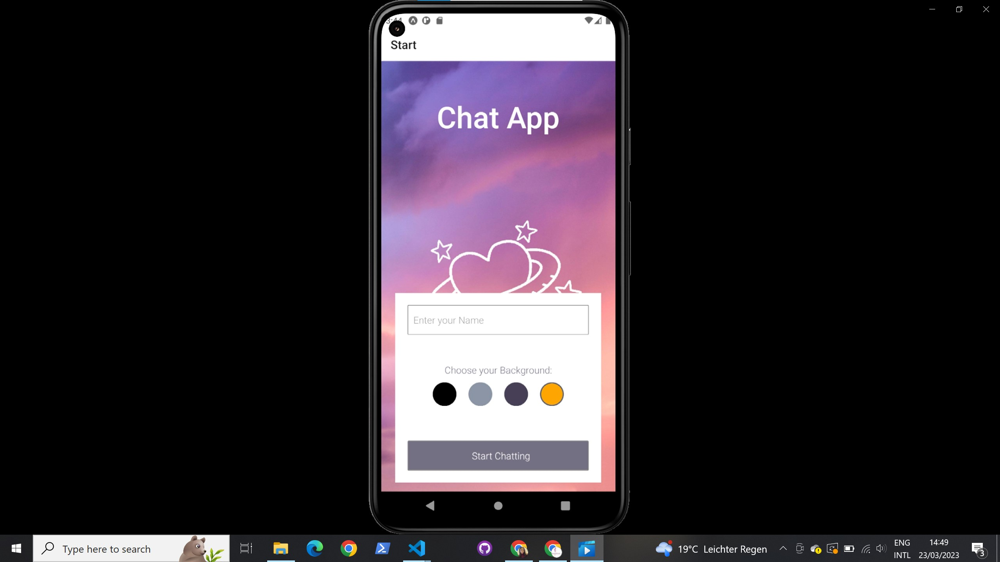
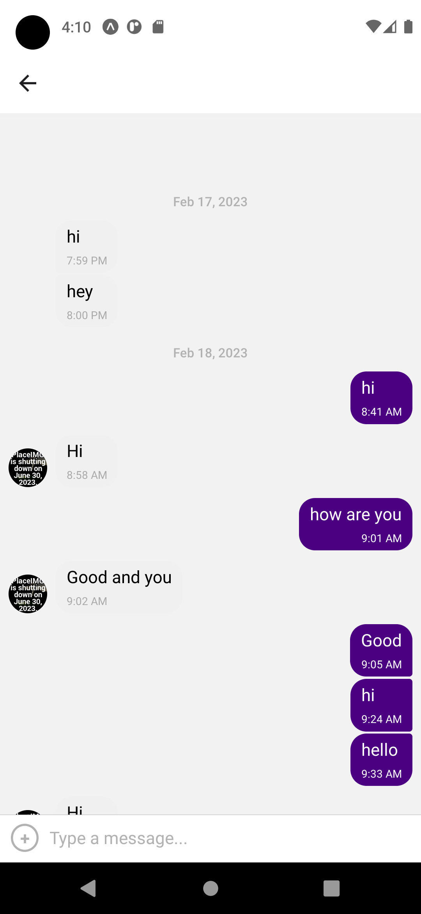

# Chat App

## Objective

A Chat App for mobile devices using React Native. The app will provide users with a chat interface and options to share images and their location.

### Built with

- JavaScript
- React Native
- Expo

### My Role

Full-stack Web developer

### User Stories

- As a new user, I want to be able to easily enter a chat room so I can quickly start talking to my friends and family
- As a user, I want to be able to send messages to my friends and family members to exchange
  the latest news.
- As a user, I want to send images to my friends to show them what I’m currently doing.
- As a user, I want to share my location with my friends to show them where I am.
- As a user, I want to be able to read my messages offline so I can reread conversations at any time.
- As a user with a visual impairment, I want to use a chat app that is compatible with a screen reader so that I can engage with a chat interface.

### Key Features

-A page where users can enter their name and choose a background color for the chat screen
before joining the chat.

- A page displaying the conversation, as well as an input field and submit button.
- The chat must provide users with two additional communication features: sending images
  and location data.
- Data gets stored online and offline.

### Dependencies

    "@react-native-async-storage/async-storage": "~1.17.3",
    "@react-native-community/masked-view": "^0.1.11",
    "@react-native-community/netinfo": "9.3.5",
    "@react-navigation/bottom-tabs": "^6.5.4",
    "@react-navigation/native": "^6.1.3",
    "@react-navigation/stack": "^6.3.12",
    "expo": "~47.0.12",
    "expo-image-picker": "~14.0.2",
    "expo-location": "~15.0.1",
    "expo-permissions": "~14.0.0",
    "expo-status-bar": "~1.4.2",
    "firebase": "8.10.1",
    "react": "18.1.0",
    "react-native": "0.70.5",
    "react-native-gesture-handler": "~2.8.0",
    "react-native-gifted-chat": "^1.1.1",
    "react-native-maps": "1.3.2",
    "react-native-reanimated": "~2.12.0",
    "react-native-safe-area-context": "4.4.1",
    "react-native-screens": "~3.18.0",
    "react-navigation": "^4.4.4"

### Main view

### Chat page

